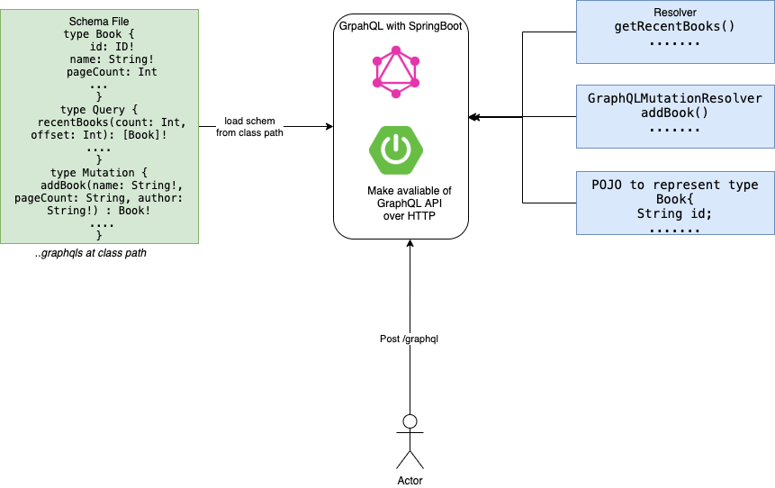

# spring-graphql

Schema example

	type Book {
	    id: ID!
	    name: String!
	    pageCount: Int
	    author: Author!
	}
	
	type Author {
	    id: ID!
	    firstName: String!
	    lastName: String
	    books: [Book]!
	}
	
	# The Root Query for the application
	type Query {
	    recentBooks(count: Int, offset: Int): [Book]!
	    bookById(id: ID) : Book
	}
	
	# The Root Mutation for the application
	type Mutation {
	    addBook(name: String!, pageCount: String, author: String!) : Book!
	    addAuthor( firstName: String!, lastName: String) : Author
	}

Example GraphQL query

To query 10 recent book with book name and author first Name

	{
	  recentBooks(count: 10){
	    name
	    author {
	      firstName
	    }
	  }
	}

To query 5 recent book with book name and author first Name and last name

	{
	  recentBooks(count: 10){
	    name
	    author {
	      firstName
	      lastName
	    }
	  }
	}
Mutation to add a Author and return id and FirstName

	mutation {
	  addAuthor(
	    firstName: "andy",
	    lastName: "Hop",
	  ) {
	    id
	    firstName
	  }
	}
Query to get Book by id

	{
	  bookById(id: "book10"){
		    name
	      id
		    author {
		      firstName
		      lastName
		    }
		  }
		}
